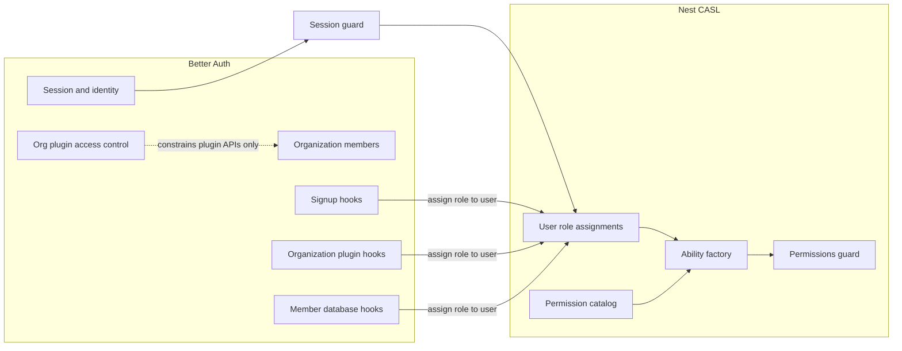

# CASL Authorization

This starter ships with a CASL-based authorization model (permission catalog, roles, Better Auth for auth). Treat it as a **starting point**, not a fixed product rule. Extend it for your application: change roles, resources, and how assignments are scoped. You do **not** have to keep the system vs organization split. Depending on product requirements, every user might be system-scoped, every user might be organization-scoped, or you might use a different mix. The patterns below explain how *this* template works today so you can reuse or reshape them deliberately.

## Why this setup exists

This API needs two related but separate jobs:

1. **Authentication** — prove who the caller is (signed-in user, session, organization membership).
2. **Authorization** — decide what that user is allowed to do on Nest routes and interactors.

We use **[Better Auth](https://www.better-auth.com/)** for authentication (email/password, sessions, organization plugin, invitation accept flows). We use **[CASL](https://casl.js.org/)** for authorization: each request builds an ability from permission codes, and Nest guards check those abilities.

**Why not authorize with role names alone?** Roles like `super_admin`, `manager`, and `customer` are useful for *assigning* access (invites, membership), but hard-coding `if (role === "manager")` on every endpoint does not scale. Capabilities change per product feature. Permission codes (`invitation:create:allow`, `user:list:allow`, …) stay stable while role → permission mappings live in one catalog and seeders.

**Why not use Better Auth’s organization-plugin permission system for Nest authz?** Better Auth org access control is built around organization membership. Using it as the app’s primary authorization model effectively means **every authorized user must always belong to an organization**. This template needs users who are not org-bound (system roles such as `super_admin` / `manager` with `user_roles.organization = null`). CASL + `user_roles` supports both org-scoped and org-free assignments. Better Auth org AC stays in place only to constrain **Better Auth organization-plugin APIs** (`permissions.constants.ts`), not Nest route authorization.

**Mental model:**

- Better Auth answers: “Who is this, and which org are they in?”
- CASL answers: “Given their assigned roles, may they create an invitation / list members / …?”
- A role is an **assignment bag**: it grants a set of permission codes. Nest routes check the codes, not the role slug.

Permission codes come from the CASL catalog (`permissions.catalog.constants.ts`) and seeders. Nest authorization always goes through CASL.

## How this ties in with Better Auth

| Layer | Owns | Source of truth |
| ----- | ---- | --------------- |
| Better Auth | Session, sign-up/sign-in, org plugin members, Better Auth org access control | `src/modules/auth`, `permissions.constants.ts` |
| Nest CASL | Route/interactor authorization, ability rules | `user_roles` + permission catalog + `CaslPermissionsGuard` |

Nest `SessionGuard` validates the Better Auth session, then loads rows from `user_roles` for the active organization context. `CaslAbilityFactory` builds a CASL ability from those roles. `CaslPermissionsGuard` enforces `@Permissions(...)`.

Better Auth org access control in `src/modules/permissions/permissions.constants.ts` constrains **Better Auth organization-plugin APIs only**. Do not use it for Nest (or frontend) authorization. The main product reason: org-plugin permissions assume membership in an org, which would force system-level users into an organization just to authorize them.

Three bridges write CASL assignment rows via `assignRoleToUser`:

1. **Signup hooks** — system invite signup with `x-invitation-token` → `finalizeUserSignup`
2. **Organization plugin hooks** — accept invitation / create organization
3. **Member database hooks** — member create (keeps `Member.role = customer`)

System roles live only in `user_roles` with `organization = null`. Nest authorization reads `user_roles`. For organization members, `Member.role` stays `customer` and is not the CASL source.



Key files: `src/modules/auth/auth.config.ts`, `auth.organization.hooks.ts`, `auth-invitation.helpers.ts`, `src/modules/casl/*`.

## Roles: system vs organization-bound

| Slug | Kind | `user_roles.organization` | Better Auth `Member.role` |
| ---- | ---- | ------------------------- | ------------------------- |
| `super_admin` | System | `null` | N/A for CASL |
| `manager` | System | `null` | N/A for CASL |
| `customer` | Org-bound | `<orgId>` | `customer` |

**Self-serve onboarding exception:** open signup (no invite) assigns a **provisional** `customer` row with `organization = null` and `user.state = NOT_ONBOARDED`. That provisional row grants `organization:create` so the founder can call `POST /organizations`. On first org create (or org invite accept), the provisional row is removed and replaced with an org-bound `customer` row; state becomes `ACTIVE`.

Constants: `SYSTEM_LEVEL_ROLES`, `ORGANIZATION_BOUND_ROLES` in `permissions.role-priority.constants.ts`.

Multi-role users get the **union** of all assigned role permission codes (deduped by code).

`resolveEffectiveRole` picks the highest-priority role for priority checks, `CaslAbilityFactory` (empty ability if none), `CaslPermissionsGuard` organization-requirement exceptions, and invite/service policy. It is **not** a substitute for `@Permissions` on routes.

## Permission catalog

Source: `src/modules/permissions/permissions.catalog.constants.ts`, seeded by `Seed20260723000001_Roles` / `Seed20260723000002_Permissions` (via `DevSeeder` / `ProdSeeder`).

- **Actions** (`EPermission`): `page_view`, `list`, `read`, `create`, `update`, `delete`, `cancel`, `manage`
- **Resources** (`EResource`): `all`, `user`, `role`, `organization`, `member`, `invitation`, `permissions`, plus page resources (`dashboard`, `ai_chat`, …)
- **String format** via `createPermission`: `resource:action:allow|deny`, optional 4th segment `condition:<type>` (see below)

High-level seeded capabilities:

- **super_admin**: `all:manage:allow` plus all page views
- **manager**: org/user/member/invitation APIs and page views (no `organization:create`, no `user:page_view`)
- **customer**: org create/list/read, limited member/invitation/user read, page views including billing (no `user:page_view`)

### Why `page_view` and `read` are separate

They answer different questions:

| Permission | Means | Typical use |
| ---------- | ----- | ----------- |
| `page_view` | May open this **screen / route** in the product UI | Frontend `withPermissionGuard(..., PAGE_VIEW, RESOURCE)`, sidebar menu filtering |
| `read` | May fetch a **single resource record** from the API | Nest `@Permissions([createPermission(EResource.USER, EPermission.READ)])` on a get-by-id handler |
| `list` | May fetch a **collection** of that resource | Nest list endpoints |

`page_view` is navigation and UX access (“may open this route”). `read` / `list` are API data access (“may fetch these records”). Keeping them separate means opening a screen does not automatically unlock every related collection, and listing data does not automatically unlock every related screen.

Concrete example (customer):

- They get `organization:page_view`, so they can open the organization screen.
- They get `member:list` / `member:read`, so on that screen (or related org UI) they can load **members of their own organization**.
- Those are different permissions on purpose: page access (`organization:page_view`) is not the same as member collection access (`member:list`), and neither is the same as a broader users-admin experience (`user:page_view` / platform-wide `user:list`).

Page-only resources such as `dashboard` and `ai_chat` only define `page_view` because there is no “read a dashboard entity” API in the same sense.

Rule of thumb:

- Protect **pages** with `page_view`.
- Protect **Nest CRUD/list handlers** with `list` / `read` / `create` / `update` / `delete` / `cancel`.
- Do not treat `page_view` as a substitute for API `read`, or `read` as a substitute for opening a page.

### Optional 4th segment: `condition:<type>`

A permission string is usually three parts:

```text
resource:action:allow
# example: invitation:create:allow
```

It can add a fourth segment that declares a **scope condition**:

```text
resource:action:allow:condition:<type>
# example: invitation:list:allow:condition:organization_id
```

`createPermission` builds this when you pass `conditionType` (see `permission-string.helpers.ts`). Types (`EPermissionConditionType`):

| Type | Meaning when the ability is built |
| ---- | --------------------------------- |
| `none` (default; no 4th segment) | Unconditional: `can(action, resource)` with no CASL conditions object |
| `organization_id` | Scoped to the active organization as `{ organizationId: <activeOrgId> }` |
| `organization_resource_id` | Scoped when the subject’s own `id` is the active organization: `{ id: <activeOrgId> }` |

**Why conditions exist:** some grants should mean “allowed **only inside the current organization context**,” not “allowed for every organization in the system.” CASL conditions attach that scope to the rule. At check time, `CaslPermissionsGuard` can pass a subject instance (for example `{ organizationId }` from params or the active org) so `ability.can(action, subject)` matches only when the condition fields align.

**How the factory applies them** (`CaslAbilityFactory.resolveConditions`):

- If there is no active organization and the permission requires `organization_id` or `organization_resource_id`, that rule is skipped (not added to the ability).
- `none` rules always apply as plain action + resource.

**Current seed state:** the catalog seeds permissions with `conditionType: none` today. The string format, entity field, factory, and guard subject extraction already support scoped rules so you can introduce org-scoped permissions later without changing the permission-string shape. Until you seed or assign conditioned codes, Nest authz behaves as unconditional allow/deny on resource + action (plus service-layer checks such as invite matrices).

## Request path

1. `SessionGuard` — validates session, attaches user, loads roles via `UserRolesService.getUserRoles(userId, activeOrganizationId)`
2. `@Permissions([createPermission(...)], { requireActiveOrganization?: true })` — declares required permission codes
3. `CaslPermissionsGuard` — builds ability via `CaslAbilityFactory`, checks each required permission
4. Redis — `CaslCacheService` caches rules (`CASL_CACHE_TTL_SECONDS`, default 300s). Key shape: `casl:rules:user:{userId}:org:{orgId|none}`

`requireActiveOrganization: true` rejects a missing active organization unless the caller already has the ability (for example `all:manage`) or holds a system-level role (guard exception via `resolveEffectiveRole`).

## Protecting a Nest route

```typescript
@UseGuards(CaslPermissionsGuard)
@Permissions([createPermission(EResource.INVITATION, EPermission.CREATE)])
async createInvitation(...) { ... }

@UseGuards(CaslPermissionsGuard)
@Permissions([createPermission(EResource.MEMBER, EPermission.LIST)], {
  requireActiveOrganization: true,
})
async listMembers(...) { ... }
```

After **service-layer** role mutations (`members`, `organizations`), call `CaslCacheService.invalidateUser`. Auth hooks that call `assignRoleToUser` do **not** invalidate Redis today; do not assume hooks already clear the cache.

## Invitations

Expiry: `INVITATION_EXPIRY_DAYS = 7`. Statuses: `pending` | `accepted` | `rejected` | `canceled`.

Invite who-can-invite-whom (`INVITATION_PERMISSION_MATRIX`):

| Inviter effective role | May invite |
| ---------------------- | ---------- |
| `super_admin` | `super_admin`, `manager`, `customer` |
| `manager` | `manager`, `customer` |
| `customer` | `customer` only (and must be the **organization creator**) |

System target roles must not include an organization. Customer targets require an organization.

### System invite (`super_admin` / `manager`)

1. `POST /invitations` with a system role → DB row with `organization = null` and hex `token`
2. Email → `{WEB_CLIENT_BASE_URL}/invite/system/accept?token=<hex proof token>`
3. `GET /invitations/system/validate?token=` (public)
4. Sign-up with header `x-invitation-token`
5. Better Auth signup hook → `finalizeUserSignup` → `user_roles` (`organization = null`), invitation `accepted`

### Organization invite (`customer`)

1. `POST /invitations` (or org invite via users) with active org
2. Customer inviter → Better Auth `createInvitation`; system inviter → direct DB invitation + email
3. Email → `{WEB_CLIENT_BASE_URL}/invite/accept?token=<invitation UUID>` (id, not the hex token column)
4. `GET /invitations/organization/validate?id=` (public)
5. Better Auth org accept → hooks assign `user_roles` customer + org, `Member.role = customer`, mark invitation accepted

The query param name `token` means different proofs: **hex proof** for system invites, **invitation UUID** for org invites.

### Self-serve customer org creation (no invite)

1. Sign up at `/sign-up` without `x-invitation-token` → `finalizeUserSignup` assigns provisional `customer` (`organization = null`) + `NOT_ONBOARDED`
2. After email verify / sign-in, frontend routes to `/create-organization` when there is no active org and no pending invite
3. `POST /organizations` (requires `organization:create`, no active org) → org + member + `ACTIVE` + org-bound `customer`; provisional row cleared
4. Frontend sets active organization and continues to `/dashboard`

Pending org invites take priority over create-organization redirects.

## Do

- Use `@Permissions([createPermission(...)])` + `CaslPermissionsGuard` for Nest route authorization
- Treat roles as assignment bags; authorize by permission codes
- Keep system roles with `organization = null`; customer with organization id (except provisional self-serve bootstrap)
- Seed and extend permissions from the catalog + seeders
- Call `CaslCacheService.invalidateUser` after service-layer role mutations
- Use `createPermission` helpers (do not hand-roll inconsistent codes)

## Don't

- Gate Nest routes on role slugs instead of CASL permissions. Avoid patterns like:

```typescript
// Bad: role slug check on a Nest route / interactor
if (user.roles.includes(EUserRole.MANAGER) || user.roles.includes(EUserRole.SUPER_ADMIN)) {
  return this.invitationsService.create(...);
}
throw new ForbiddenException();

// Good: declare the permission and let CaslPermissionsGuard enforce it
@UseGuards(CaslPermissionsGuard)
@Permissions([createPermission(EResource.INVITATION, EPermission.CREATE)])
async createInvitation(...) { ... }
```

  Role checks are fine in **invite/assignment domain logic** (for example `INVITATION_PERMISSION_MATRIX`). They are not a substitute for route authorization.

- Use Better Auth org access control (`permissions.constants.ts`) for Nest authorization
- Assign a system role with an organization, or `customer` without one
- Put non-customers in `members`
- Invite roles outside `INVITATION_PERMISSION_MATRIX`, or attach `organizationId` to system-role invites
- Assume `Member.role` drives CASL
- Skip cache invalidation after service-layer role updates
- Assume auth hooks already invalidate the CASL Redis cache
