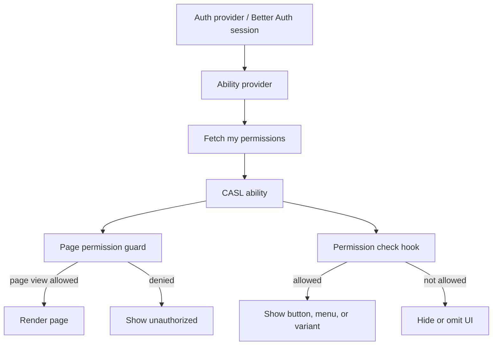

# CASL Authorization

## Before you start

If you have not read the Nest backend guide yet, start there. It explains **why** we split authentication (Better Auth) from authorization (CASL), how roles assign permission codes, and how invites write into `user_roles`. This frontend guide assumes that mental model and focuses on how the web app **loads** those rules and **shows or hides** UI.

Backend guide (sibling template): [`docs/features/casl-authorization.md`](https://github.com/SazimTech/nestjs-mikro-orm-starter-template/blob/development/docs/features/casl-authorization.md) in the Nest starter.

## Why the frontend works this way

The UI needs two answers on every protected screen:

1. **Are you signed in?** — Better Auth session via `AuthProvider` (sign-in, sign-up, active organization, accept org invitation).
2. **May you see this page or button?** — CASL abilities from Nest via `AbilityProvider` (`GET /permissions/my`).

We do **not** hide buttons with `if (role === "manager")`. Role slugs (`super_admin`, `manager`, `customer`) are for invite/change-role forms and labels. Page access and action visibility use permission checks (`page_view` on a resource, `create` on `invitation`, and so on). That stays aligned with the backend catalog: if Nest grants `invitation:create`, the Invite button can appear; if not, hide it.

**Mental model:**

- Better Auth client: who you are and which organization is active.
- Nest CASL rules: what you can do; the frontend only mirrors those rules for UX.
- Nest remains the real enforcement. Frontend gates improve UX and avoid dead-end clicks; they are not a security boundary by themselves.

## Better Auth vs CASL on the client

| Concern                    | Source                              | What the frontend uses                                                    |
| -------------------------- | ----------------------------------- | ------------------------------------------------------------------------- |
| Who is signed in           | Better Auth client (`AuthProvider`) | Session, sign-in/up, active organization, `organization.acceptInvitation` |
| What they can do in the UI | Nest CASL rules (`AbilityProvider`) | `GET /permissions/my` → `useCan` / `ability.can` / page guards            |

`AuthProvider` wraps `AbilityProvider` in `pages/_app.page.tsx`. Abilities load only when authenticated. Do not gate UI on Better Auth `activeOrganizationRole`; gate on CASL abilities.



- **Page level:** `withPermissionGuard(ProtectedRoute, PAGE_VIEW, RESOURCE)` → render the page or `<Unauthorized />`. `ProtectedRoute` only checks that the user is signed in; permission gating is the HOC / `AuthorizationGuard`.
- **Action / chrome level:** `useCan` / `ability.can` → show or hide buttons, sidebar items, dashboard variants.
- **Loading:** wait for `isAbilityLoading` / `useCan.isLoading` before deciding show vs hide.

## AbilityProvider

Location: `shared/providers/AbilityProvider/`.

1. Reads auth from `useAuth()` (`isAuthenticated`, `user`, `activeOrganizationId`)
2. Fetches `GET /permissions/my` via RTK Query (`useGetMyPermissionsQuery`)
3. Cache key: `` `${userId}:${activeOrganizationId ?? "none"}` `` so organization context changes refetch abilities
4. Builds `createMongoAbility(data?.rules ?? [])`

Also invalidate the RTK `Permissions` tag after invite accept and explicit organization activate where the app already does so (for example accept-invitation flow and org detail setActive).

## Primary check APIs

Live patterns in this codebase:

| API                                          | Use for                                              |
| -------------------------------------------- | ---------------------------------------------------- |
| `useCan(action, resource, conditions?)`      | Buttons and conditional UI                           |
| `ability.can` via `useAbilityContext`        | Sidebar, invite role options, Unauthorized “Go Back” |
| `withPermissionGuard` / `AuthorizationGuard` | Page access                                          |

`Can` and `useCanForAnyResource` are exported from `AbilityProvider` but are not the primary UI patterns today. Prefer `useCan` / `ability.can` / `withPermissionGuard`.

Enums (`EPermission`, `EResource`, `EUserRole`) come from Swagger codegen (`shared/typedefs`). Prefer `pnpm swagger-codegen` over hand-authoring.

### Why `page_view` and `read` are separate (frontend view)

On the web app you mostly care about **`page_view`** for routes and menus, and action permissions (`create`, `cancel`, …) for buttons. **`read` / `list`** are primarily Nest API permissions.

They stay separate so page access and data access can be granted independently. Example: a **customer** can have `organization:page_view` plus `member:list` / `member:read` to open the organization screen and see **members of their own organization**. That does not require (or imply) Users-admin page access or platform-wide user listing.

Full detail (including optional `condition:<type>` on permission strings): Nest backend `docs/features/casl-authorization.md` → Permission catalog.

## Page vs action gating

Wire protected pages:

```typescript
MyPage.Guard = withPermissionGuard(
  ProtectedRoute,
  EPermission.PAGE_VIEW,
  EResource.DASHBOARD,
);
```

Examples: `pages/dashboard`, `pages/users`, `pages/organizations`, `pages/ai-chat`, `pages/billing`, `pages/settings`, `pages/document-vector-store`.

Action checks:

```typescript
const { can: canCreateInvitation, isLoading } = useCan(
  EPermission.CREATE,
  EResource.INVITATION,
);

if (!isLoading && canCreateInvitation) {
  // render Invite button
}
```

`ProtectedRoute` alone only checks signed-in (and related auth). It is not a permission gate.

## Roles in the UI

| Slug          | Kind      | Needs org on invite? | Change-role API             |
| ------------- | --------- | -------------------- | --------------------------- |
| `super_admin` | System    | No                   | `POST members/system-roles` |
| `manager`     | System    | No                   | `POST members/system-roles` |
| `customer`    | Org-bound | Yes                  | `PATCH members`             |

- Invite role options: `getInviteRoleOptionsForAbility` filters by **permissions**, not role slug (superuser-like UI via `all:manage` or `organization:delete`).
- Superuser dashboard variant: `useCan(MANAGE, ALL)` or `useCan(DELETE, ORGANIZATION)`.
- Role slugs belong in invite/change-role form payloads and labels only.

## Invite UI flows

Routes: `INVITE_ACCEPT_ROUTE` (`/invite/accept`), `SYSTEM_INVITE_ACCEPT_ROUTE` (`/invite/system/accept`).

The query param `token` means different proofs:

| Flow   | Route                   | `token` meaning | Accept path                                                                |
| ------ | ----------------------- | --------------- | -------------------------------------------------------------------------- |
| Org    | `/invite/accept`        | Invitation UUID | Better Auth `organization.acceptInvitation`, then invalidate `Permissions` |
| System | `/invite/system/accept` | Hex proof token | Continue to sign-up with `x-invitation-token` header                       |

Create invite UI: `modules/users/components/CreateUserDialog` (Invite User). Org detail can gate the invite button with `useCan(CREATE, INVITATION)`.

Accept containers: `modules/invite/containers/AcceptInvitationContainer`, `AcceptSystemInvitationContainer`.

### Self-serve create organization

Open signup (no invite) lands provisional customers on `/create-organization` after verify/sign-in when they have no active org. Pending invites still win: the create-organization container redirects to `/invite/accept` when `GET /invitations/my-pending` returns a row.

Unauthorized fallback: if the user can `organization:create` and has no pending invite, show **Create organization**.

## Do

- Gate routes and UI with `EPermission` + `EResource` (CASL)
- Use `withPermissionGuard` for page `page_view` access
- Use `useCan` / `ability.can` for action buttons and menu filtering
- Detect superuser UI with `all:manage` or `organization:delete`, not role slugs
- Wait for ability loading before rendering gated UI
- Rely on the AbilityProvider organization cache key (and invalidate `Permissions` after invite accept / explicit org activate where already done)
- Keep role slugs for assignment/display only; use swagger-codegen for enums

## Don't

- Gate UI or routes on role slugs. Avoid:

```typescript
// Bad
if (activeOrganizationRole === "manager") {
  return <InviteButton />;
}

// Good
const { can, isLoading } = useCan(EPermission.CREATE, EResource.INVITATION);
if (!isLoading && can) {
  return <InviteButton />;
}
```

- Treat `ProtectedRoute` as a permission gate
- Rely on `activeOrganizationRole` for authorization
- Hand-author permission/resource/role enums that Swagger already provides
- Assume `Can` is required (prefer `useCan` / `ability.can`)
